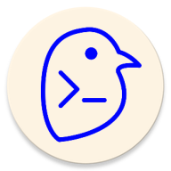

<div align="center">
  

  # Bird Launcher

  **A minimalist command-line style Android launcher**

  [](LICENSE)
  [](https://www.android.com/)

</div>

---

## ✨ Features

- **CLI-Style Interface** - Launch apps by typing their names in a terminal-like interface
- **Smart Search** - Fuzzy search for installed applications
- **Web Search** - Quick web searches with `web <query>` command
- **Pinned Apps** - Pin your favorite apps to the top for quick access
- **All Apps List** - Browse all installed apps with icons in a convenient bottom sheet
- **Material You Integration** - Dynamic theming that adapts to your wallpaper
- **Customizable Prompt** - Personalize your command prompt
- **Visual Customization** - Adjust blur and opacity of overlay elements
- **App Settings** - Configure individual app preferences
- **Minimal & Fast** - Lightweight launcher focused on efficiency

## 📦 Installation

Download the latest APK from the [Releases](https://github.com/skyerisen/bird/releases) page.

### Requirements
- Android 8.0 (API 26) or higher

## 🚀 Usage

### Basic Commands

- **Launch an app**: Simply type the app name (e.g., `chrome`, `gmail`)
- **Web search**: `web <your search query>`
- **Clear terminal**: `clear`
- **View all apps**: Swipe up or tap the apps button

### Tips

- App names are case-insensitive
- Partial matches work - typing `mess` will find "Messages"
- Pin frequently used apps for instant access

## 🎨 Customization

Bird Launcher offers various customization options:

- **Theme**: Automatic Material You color adaptation
- **Prompt**: Customize your terminal prompt text
- **Overlay**: Adjust blur and opacity for visual effects
- **Layout**: Pin apps and organize your workspace

Access settings through the app menu.

## 🛠️ Built With

- **Kotlin** - Primary language
- **Jetpack Compose** - Modern Android UI toolkit
- **Material 3** - Material You design implementation
- **Coroutines & Flow** - Asynchronous programming

## 📄 License

This project is licensed under the MIT License - see below for details:

```
MIT License

Copyright (c) 2024 Bird Launcher

Permission is hereby granted, free of charge, to any person obtaining a copy
of this software and associated documentation files (the "Software"), to deal
in the Software without restriction, including without limitation the rights
to use, copy, modify, merge, publish, distribute, sublicense, and/or sell
copies of the Software, and to permit persons to whom the Software is
furnished to do so, subject to the following conditions:

The above copyright notice and this permission notice shall be included in all
copies or substantial portions of the Software.

THE SOFTWARE IS PROVIDED "AS IS", WITHOUT WARRANTY OF ANY KIND, EXPRESS OR
IMPLIED, INCLUDING BUT NOT LIMITED TO THE WARRANTIES OF MERCHANTABILITY,
FITNESS FOR A PARTICULAR PURPOSE AND NONINFRINGEMENT. IN NO EVENT SHALL THE
AUTHORS OR COPYRIGHT HOLDERS BE LIABLE FOR ANY CLAIM, DAMAGES OR OTHER
LIABILITY, WHETHER IN AN ACTION OF CONTRACT, TORT OR OTHERWISE, ARISING FROM,
OUT OF OR IN CONNECTION WITH THE SOFTWARE OR THE USE OR OTHER DEALINGS IN THE
SOFTWARE.
```

## 🤝 Contributing

Contributions, issues, and feature requests are welcome! Feel free to check the [issues page](https://github.com/skyerisen/bird/issues).

## 📸 Screenshots

*Coming soon*

---

<div align="center">
  Made with ❤️ for Android power users
</div>
